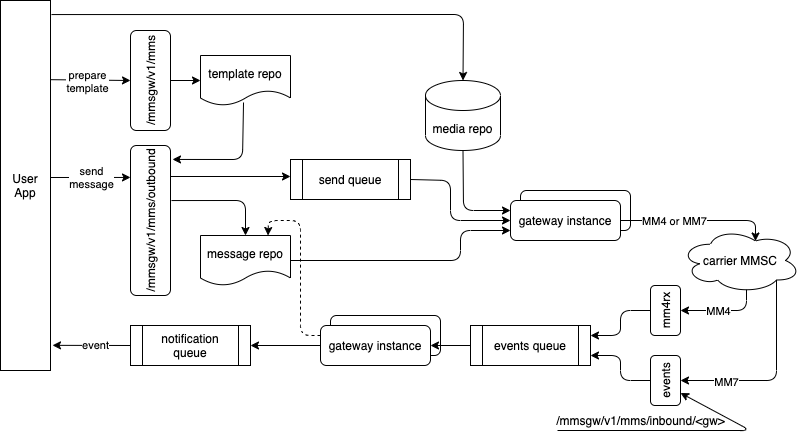
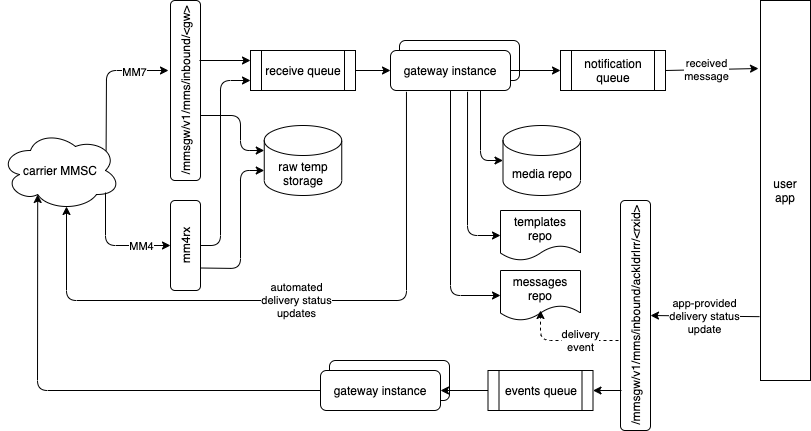

## High Volume MMS Gateway (MM4 and MM7)

NOTE: This product is still a work in progress. At this time, the MM7 gateway is still not fully prepared to accept incoming messages.


### Intro

This MMS gateway sends and receives multimedia messages (containing text, images, audio and/or video) to and from mobile phones. On the device side, the mobile application that handles MMS is the same well known application used to send and receive text messages (SMS). To operate the gateway, you would need to obtain a connection with a mobile carrier, or with an SMS aggregator, that supports any of the MM4 or MM7 standard protocols.

`mmsgw` offers a REST API to the application side, that you use to prepare and send messages. Your application will also have to accept certain callback REST API requests: these will either carry incoming MMS messages, or progress events about the messages you sent. If you plan on sending the same message to multiple devices, you have the capability to use message templates, and personalize the message for each individual destination. You will also have a few management and monitoring tools available.


### How it works

To send a message, you will first need to prepare a message template to be sent out. A template contains the individual parts of the MMS message, like the picture(s) that need to be sent, the accompanying text, and instructions on how to format the message on the destination device. Large parts, like images, will be referenced with an `http` or a `file` URL - more about this in the next chapter. Once the template was prepared, the application can request an MMS message to be built and sent. The MMS message will be placed in a queue according to its priority, and will be picked up by the appropriate gateway function, formatted according to the MM4 or MM7 protocol, and sent to the carrier / aggregator. After the message was sent, the gateway will start receiving incoming events, like notifications of the message being delivered, or errors occurred during the transmissions. These are (optionally) forwarded as callback REST API requests to your application. 



Incoming messages are also received by the gateways. They are parsed, in structures similar to the templates, briefly queued, and eventually communicated to your application via the callback APIs. The parts of the message are made available as `http` as well as `file` URLs. Some of the protocol requirements, like providing a message receipt acknowledgement, can be automated by the gateway, but you can also have the gateway wait for your application to provide the proper response.



### Infrastructure and internal layout

The application-facing API stores the message templates, and references to the content parts, in a Redis memory store. You can choose a desired time-to-live for your templates, or you can just rely on redis' built-in capability to purge the oldest records. The large content parts are stored as URL references in the redis data structure, with the content itself stored in regular files. 

At the time a message is picked up from the queue and prepared for sending, the gateway will use the parts URLs to retrieve the actual content, and attach it to the message. It can do that in 2 ways: either the reference is an `http` URL, and the gateway will try to perform a GET request to get the binary content; or, the reference can be a `file` URL, in which case the gateway will attempt to open the file as binary, and read the content from it. In the first case, the application needs to make sure the content files are placed in the right location, so that their `http` URL refers to them properly. (Obviously, the application can just as well implement the http server role itself.) In the other case, both the application and the gateway need to have access to the directory where the content files are stored. In large installations, it is expected that there will be multiple gateway instances, and multiple application instances, spread across multiple computers or VM instances, but all of them need to use the same network storage directory. The directory may appear to have different names for different gateway or application instances, depending on their network placement. 

A similar layout is used for received MMS messages (MO): the messages are parsed, and the large (non-text) parts are stored as individual files, placed in common network storage directories. From there, the application can collect them by opening them, by making a copy, or it can download them from an `http` URL serviced by the `mmsgw` API.

Just like the templates, the metadata for the outgoing messages is also stored as a redis data structure, and similar rules apply regarding the eviction of the data from the memory store. The data structure for both sent and received messages is the same. The messages metadata should persist long enough such that all the events regarding the message, including delivery reports and read receipts, can be related to the message. The whole conversation could take as long as days, depending on the network availability of the mobile device, and the time when the user actually opened the message in the mobile app.

The message queues (sent messages, received messages, and received events) are implemented with [rq](https://python-rq.org/), which is also based on a trivial redis memorystore backend. 


### Gateways and Gateway Instances

A gateway is the software component that directly interacts with your upstream providers MMSCs. It transforms your MT requests in formats suitable for transmission, sends them to the selected provider, then reports transmission progress events back to your application. Going the other way, it parses the received MOs and sends them to your app, while also providing the remote MMSC with progress events.

In normal circumstances, you would want to have more than one instance of the gateway software run at the same time, to accommodate for the following scenarios:


1. Multiple gateway instances are connected to multiple MMSCs hosted by a provider, via multiple multiple network routes, for redundancy.
2. Multiple gateway instances are connecting to the same MMSC, for load sharing.
3. A combination of the situations above.

Depending on the MMS protocol, gateways are either MM4 or MM7. All the instances of a gateway must be the same type - either MM4, or MM7.

A gateway instance is a running instance of the `gw.py` script. Start the script with the gateway configuration filename as a command line parameter. Each gateway instance is identified by an unique ID, which is a combination of:


*   the group name;
*   the gateway configuration ID;
*   the hostname, as returned by the `gethostname()` function;
*   the process id for the gateway, as returned by the `getpid()` function. 

The `gw.py` script initializes the gateway, start its heartbeat (more on that below), and then loops handling tasks in 3 queues:


*   the transmission (TX) queue;
*   the events (EV) queue; and
*   the receiving (RX) queue

The queues are a gateway resource; all instances of the same gateway share the same 3 TX, EV and RX queues. If a gateway is unable to process a transmission job, for example because it cannot reach its MMSC peer, the job gets rescheduled, so that another gateway instance (queue worker) can give it a try. There is a limit on how many times a job is rescheduled; if this limit is reached, an event is sent back to the client app, indicating the transmission failed.

A gateway heartbeat is a mechanism that monitors its connection to the MMSC it is configured for, at regular intervals of time. If a successful connection is established, the gateway updates its own heartbeat record, and sets the expiration time a few times longer than the monitoring time interval. A gateway is considered dead if its heartbeat record expired. Unless you have an automated restarting process in place, you would be responsible to manually restart the gateway instance(s) when you think the problem was corrected.

Messages in the transmission queue are rendered according to the gateway protocol (MM4 or MM7), then transmitted to the corresponding upstream MMSC. The transaction record is preserved in the transient storage, and gets updated when delivery progress events are communicated back from the MMSC. The events received are also propagated to the client app, as callback https requests. 

The MMS messages in the receiving queue are parsed, and determined to be either delivery progress events, or MOs. They are handled correspondingly, and delivered to the client app as https callback requests. For MOs, a message receipt confirmation is immediately sent to the MMSC that transmitted the message; a delivery receipt and a read-reply are sent as soon as the client app sends a response to the callback request.

An MM4 gateway can receive SMTP events and MOs in a couple of ways. We supply an SMTP server in the `mm4rx.py` script, that receives all emails, and dispatches them appropriately to gateway receive and event queues. The `mm4rx.py` script can also do the dispatch task when files containing incoming emails are posted in a directory. This is useful if you operate a high performance SMTP server, like postfix, and you provide capabilities to store the emails received as plaintext files. 

An MM7 gateway receives events and MOs as http requests from the upstream MMSC. They are handled in the message module. Events and MOs are parsed and dispatched to the appropriate gateway EV or RX queue.


### API and callbacks

This section details the interface offered by `mmsgw`, facing the application side. The content type for all requests that require a content is expected to be `application/json`. 


```
POST /mmsgw/v1/mms
```


Creates an MMS message template. The JSON content is a dictionary with the following elements:


*   <strong><code>origin</code></strong> (required; string, default empty): sender code, phone number or shortcode, that the messages will appear as being sent from; most providers will require this
*   <strong><code>show_sender</code></strong> (bool, default <code>true</code>): whether the sender is disclosed to the recipient
*   <strong><code>earliest_delivery</code></strong> (timestamp represented as epoch): do not deliver earlier than this timestamp; must indicate a timestamp in the future; if missing, schedule immediately; <code>mmsgw</code> will schedule sending at that time, and will pass the value on to other providers
*   <strong><code>latest_delivery</code></strong> (timestamp represented as epoch): do not deliver later than this timestamp; must indicate a timestamp in the future; missing means no lifetime limit; <code>mmsgw</code> will make sure the message metadata is preserved for at least that long, and will pass this parameter on to other providers; it is up to the providers to respect the restriction
*   <strong><code>expire_after</code></strong> (integer, seconds): it is ok not to maintain the message or its delivery information in the network anymore, after that many seconds; <code>mmsgw</code> will expire the message itself that many seconds, and will pass this parameter on to other providers; it is up to the providers to respect the requested behavior
*   <strong><code>message_class</code></strong> (string, see constants.py file for acceptable values): some providers may require this parameter to be set according to the content
*   <strong><code>content_class</code></strong> (string, see constants.py file for acceptable values): some providers may require this parameter to be set according to the content
*   <strong><code>charged_party</code></strong> (string, see constants.py file for acceptable values): check with provider if supported
*   <strong><code>drm</code></strong> (bool, default <code>false</code>): DRM (digital rights management) content indicator; check with provider if required and/or supported 
*   <strong><code>content_adaptation</code></strong> (bool, default <code>false</code>): enables other network providers to perform changes to the content, and optimize for delivery (e.g. image transcoding); check with providers if supported and respected
*   <strong><code>can_redistribute</code></strong> (bool, default <code>false</code>): indicates whether the message can be forwarded by the recipient; check with providers if supported and respected
*   <strong><code>subject</code></strong> (string): arbitrary text string that would be displayed above the message content
*   <strong><code>parts</code></strong> (required; list): individual message parts; each part in the list is a dictionary:
    *   <strong><code>name</code></strong> (required, string): arbitrary name for the content part
    *   <strong><code>content_type</code></strong> (required, string, see constants.py file for supported values): MIME type of the part; a part with a <code>content_type</code> of <code>application/smil</code> will always be forcefully pushed in the first position in the list 
    *   <strong><code>content</code></strong> (string): if the <code>content_url</code> field is missing, this field becomes required and carries the actual content of the part; providing a too long value here may significantly reduce the redis storage capacity, and impact the processing speed
    *   <strong><code>content_url</code></strong> (string): if the <code>content</code> field is missing, this field becomes required and carries the URL where the content can be retrieved from
*   <strong><code>send</code></strong> (dictionary): if present, a message based on this template is created and scheduled to be sent immediately; the dictionary provides message specific parameters (see description in the message structure): <strong><code>destination</code></strong>, <strong><code>cc</code></strong>, <strong><code>bcc</code></strong>, <strong><code>gateway</code></strong>

On success, <code>mmsgw</code> replies with a full description of the template object created, in a JSON dictionary form. It also includes an unique identifier for the object created, and returns it as a dictionary member called <code>id</code>. If an ad-hoc send operation was requested, ??. 


```
PUT /mmsgw/v1/mms/<template_id>
```


This method is provided to replace parameter values of an existing. The parameter names are the same as described in the POST method above. Generally, submitting part descriptors in the `parts` field would add those parts to the existing parts list. However, submitting `null` as a first parameter in the `parts` list will first clear the list, then add the rest of parts in the list. The PUT method doesn't accept a `send` parameter. The method returns a full descriptor of the template object being modified, in a JSON dictionary form.


```
DELETE /mmsgw/v1/mms/<template_id>
```


This method removes the template from the storage and cleans up the content parts.


```
GET /mmsgw/v1/mms/<template_id>
```


This method returns a full descriptor of the template object requested, in a JSON dictionary form. The significance of the dictionary members is provided in the description of the POST method above.


```
POST /mmsgw/v1/mms/outbound/<template_id>
```


This method builds a message from the template requested, and enqueues it to be sent to one or multiple recipients. Here are the parameters that need to be submitted as a JSON dictionary with this request:


*   <strong><code>destination</code></strong> (string, comma separated list of phone numbers): phone numbers where this message will be sent
*   <strong><code>cc</code></strong> (string, comma separated list of phone numbers): phone numbers where this message will also be sent, with an indication of "cc:" visible to all other destination 
*   <strong><code>bcc</code></strong> (string, comma separated list of phone numbers): phone numbers where this message will also be sent; these phone numbers will not be made visible to others
*   <strong><code>gateway</code></strong> (string): the name of the gateway that this message needs to go out thru, which is one of the "<code>group</code>" names of the active gateways (e.g. if you have <code>GW01</code>, <code>GW02</code> and <code>GW03</code> as defined gateway instances, and the first two are both configured as part of the "<code>PROV-1</code>" group, use "<code>PROV-1</code>" as a value of this API parameter, and one of GW01 or GW02 will transmit your message); there is a default gateway parameter defined in the <code>mmsgw</code> settings, that will be adopted if this parameter is missing 
*   <strong><code>priority</code></strong> (string, see constants.py file for acceptable values): the value indicates how this message needs to be prioritized by the providers in the network; <code>mmsgw</code> takes no action regarding this parameter, it will always add the messages at the end of the queue, because it relies on the application to schedule the messages in the desired order; check with your provider regarding the effectiveness of this parameter
*   <strong><code>linked_id</code></strong> (string): an optional parameter used by some applications to mark related message sequences; it propagates in the network together with the message
*   <strong><code>events_url</code></strong> (string or comma-separated list): all the events received for this particular message will generate a POST request to this URL, with a JSON description of the event; this is what is commonly known as a "hook", or "callback" into the application; this comes in addition to other URLs defined in the gateway configuration

<em>Note:</em> At least one phone number must be specified in one of the 3 lists above, otherwise the message will not be sent. 

_Note:_ Even though both MM4 and MM7 protocols allow CC and BCC distributions, and multiple destination addresses for each, we recommend checking with your provider regarding how many destinations max do they accept for a single message.

The POST method returns the full representation of a message object, as described in the GET method.


```
GET /mmsgw/v1/mms/[outbound|inbound]/<message_id>
```


The GET method returns the full representation of an outbound or an inbound message object. Outbound messages are constructed as described in the POST method above. Inbound messages are constructed whenever an incoming message is received from the network. The two message types are mostly interchangeable.


*   <strong><code>id</code></strong> (string): internal unique message ID
*   <strong><code>peer_ref</code></strong> (string): unique message ID attributed by the upstream provider; outbound messages get a value in this field after the provider acknowledged the message receipt
*   <strong><code>last_tran_id</code></strong> (string): the last transaction ID in the current message transmission dialog
*   <strong><code>ack_at_addr</code></strong> (string): the provider address where the message receipt needs to be acknowledged
*   <strong><code>direction</code></strong> (integer): direction of the message, from the mmsgw perspective: -1 for outbound, 1 for inbound 
*   <strong><code>gateway_id</code></strong> (string): which gateway instance handled the transmission or reception
*   <strong><code>gateway</code></strong> (string): name of the group the gateway instance is part of
*   <strong><code>origin</code></strong> (string, phone number): origination phone number of the message
*   <strong><code>destination</code></strong> (string, comma separated list of phone numbers): list of phone numbers where the message was sent to
*   <strong><code>cc</code></strong> (string, comma separated list of phone numbers): list of phone numbers that the message was cc'd to
*   <strong><code>bcc</code></strong> (string, comma separated list of phone numbers): list of phone numbers that the message was bcc'd to
*   <strong><code>linked_id</code></strong> (string): an optional MMS parameter used by some applications to mark related message sequences
*   <strong><code>priority</code></strong> (string, see constants.py file for acceptable values): type of priority requested for this message
*   <strong><code>relay_server</code></strong> (string):
*   <strong><code>ua_caps</code></strong> (string): User-Agent capabilities
*   <strong><code>reply_charging_id</code></strong> (string): 
*   <strong><code>handling_app</code></strong> (string): id of the application requested to handle the message
*   <strong><code>reply_to_app</code></strong> (string): id of the application requested to handle replies to this message
*   <strong><code>app_info</code></strong> (string): arbitrary application data submitted with the message
*   <strong><code>events_url</code></strong> (string): application URL to call for handling the events associated with the message
*   <strong><code>ack_requested</code></strong> (bool): whether the sender side requested an acknowledgement that the message was accepted for delivery
*   <strong><code>dr_requested</code></strong> (bool): whether the sender side requested to be notified of a successful or failed delivery 
*   <strong><code>rr_requested</code></strong> (bool): whether the sender side requested to be notified of a read receipt event <strong><code>created_ts</code></strong> (integer, timestamp as epoch): timestamp of the message object creation and enqueuing
*   <strong><code>processed_ts</code></strong> (integer, timestamp as epoch): timestamp of when the message was processed from the queue
*   <strong><code>template</code></strong> (dictionary): message template object; an artificial "template" is created for incoming messages too
*   <strong><code>events</code></strong> (list): list of events occurred over the message lifetime, chronologically ordered; each event is a dictionary with the following structure:
    *   <strong><code>code</code></strong> (string):
    *   <strong><code>state</code></strong> (string): one of: <code>SCHEDULED</code>, <code>SENT</code>, <code>FORWARDED</code>, <code>ACKNOWLEDGED</code>, <code>DELIVERED</code>, <code>FAILED</code>, <code>UNDEFINED</code>
    *   <strong><code>description</code></strong> (string): description of the event
    *   <strong><code>timestamp</code></strong> (integer, epoch representation): when event occurred
    *   <strong><code>gateway</code></strong> (string): the gateway instance that processed the event
    *   <strong><code>destinations</code></strong> (string): destination phone numbers (including the ones in cc and bcc lists) that this event applies to


```
POST /mmsgw/v1/mms/inbound/[ack|dr|rr]/<message_id>
```


Incoming messages (MOs) may require receipt acknowledgements, delivery reports, and / or read reports. The gateway can be set to automatically send back these messages to the network. However, in some circumstances, the application needs to decide what kind of response to send back regarding the incoming message. For example, if the account of the recipient of the message is currently suspended, or if the destination number would not be able to process audio files, the application would need to signal that the message delivery has failed. As such, the application will receive an event regarding the incoming message, it would consult its database, and will POST a response with one of the conditions above. In addition to that, the following JSON dictionary is expected:


*   <strong><code>gateway</code></strong> (string): the gateway that this message needs to be sent thru
*   <strong><code>message</code></strong> (string): our own message ID
*   <strong><code>peer_ref</code></strong> (string): provider's original message id
*   <strong><code>status</code></strong> (string): canonical status id
*   <strong><code>description</code></strong> (string): verbose description of the status
*   <strong><code>applies_to</code></strong> (string, comma separated list of phone numbers): phone number(s) this status applies to; missing means applies to all
