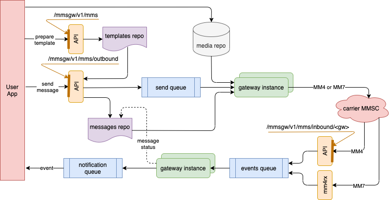
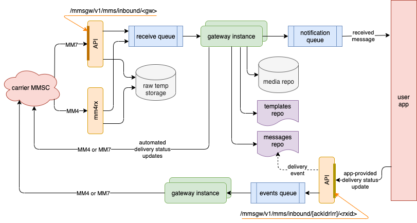

## High Volume MMS Gateway (MM4 and MM7)

### Intro

This MMS gateway sends and receives multimedia messages (containing text, images, audio and/or video) to and from mobile phones. To operate the gateway, you would need to connect to a mobile carrier, or an SMS/MMS aggregator, that supports any of the MM4 or MM7 standard protocols.

`mmsgw` offers a REST API to your application that implements the logic to prepare and send messages, and the logic to handle received messages. Your application also needs to accept certain callback REST API requests: they either carry incoming MMS messages, or progress events about the messages sent out. If you plan on sending the same message to multiple devices, you have the capability to use message templates, and to personalize each message for every individual destination. A few management and monitoring tools are also available.


### How it works

To send a message, you first need to prepare a message template. A template contains the individual *parts* of the MMS message (picture(s) or media to be sent, accompanying text, formatting instructions, etc). Large size parts, like images, are provided using an `http` or `file` URL - more about this in the next chapter. The content of the smaller size parts are stored in the template itself. 

Once the template was prepared, the application requests an MMS message to be built and sent. The MMS message is briefly placed in a transmission queue, according to its priority. It is picked up for processing by the appropriate gateway function, formatted according to the MM4 or MM7 protocol, and sent over the SMS carrier / aggregator connection. After the message was sent, the gateway is expected to receive incoming events regarding the transmission progress, or errors occurred during the transmissions. The events are (optionally) forwarded as callback REST API requests to your application. 



Incoming messages are also received by the gateways. They are briefly queued for processing, parsed into structures similar to the templates, and communicated to your application via the callback APIs. The large parts of the message are made available as `http` or `file` URLs, while the smaller parts are stored with the template. Some of the protocol requirements, like providing a message receipt acknowledgement, can be automated by the gateway, but you can also have the gateway wait for your application to provide the proper response.



### Infrastructure and internal layout

The application-facing API stores the message templates in a [redis](https://redis.io/) memory store. You can choose a desired time-to-live for your templates, or you can just rely on redis' built-in capability to purge the oldest records. The large content parts are stored as URL references in the redis data structure, with the content itself stored in regular files. 

As mentioned before, the parts that are large in size are stored in the file system. At the time a message is picked up from the queue and prepared for sending, the gateway retrieves the actual content of the large parts, and attaches it to the message. It can do that in 2 ways: either the part content is indicated with an `http` URL reference, and the gateway attempts a GET request to download the binary content; or, the reference is a `file` URL, in which case the gateway opens the file as binary, and reads the content from it. The user application needs to make sure the content is placed in the right location, and that their URLs can be resolved and accessed appropriately by all the hosts that run `mmsgw`.

A similar layout is used for received MMS messages (MO): the messages are parsed, and the large (non-text) parts are stored as individual files in shared network storage directories. From there, the application can collect them by opening them, by making a copy, or it can download them from an `http` URL serviced by the `mmsgw` API.

Just like the templates, the metadata for the outgoing messages is also stored as a redis data structure. Similar rules apply regarding the eviction of the message records from the data store. Both sent and received messages have the same data structure. The messages metadata should persist long enough, such that all the events regarding the message, including delivery reports and read receipts, can be related to the message. The whole conversation could take as long as days, depending on the network availability of the remote mobile device, and on the time when the user actually opened the message in the mobile app.

The message queues (sent messages, received messages, and received events) are implemented with [rq](https://python-rq.org/), which is also based on a trivial redis memorystore backend. 

### Gateways and Gateway Instances

A gateway is the software component that directly interacts with your upstream providers MMSCs. It transforms the message sending requests from your app in formats suitable for transmission, sends them to the selected SMS provider, and reports transmission progress events back to your application. Going the other way, the gateway parses the received MOs and sends them to your app, while also providing the remote MMSC with progress events.

In normal circumstances, you would want to have more than one instance of the gateway software run at the same time, probably on multiple hosts, to accommodate for the following scenarios:
1. Multiple gateway instances are connected to multiple MMSCs hosted by the same provider, via multiple multiple network routes, for redundancy.
2. Multiple gateway instances are connecting to the same provider MMSC, for load sharing.
3. A combination of the situations above.

Depending on the MMS protocol, a gateway is providing either MM4 or MM7 protocol communication. All the instances of a gateway must be the same type - either MM4, or MM7.

A gateway instance is a running instance of the `gw.py` script. Start the script with the gateway configuration filename as a command line parameter. Each gateway instance is identified by an unique ID, which is a combination of:
*   the group name;
*   the gateway configuration ID;
*   the hostname, as returned by the `gethostname()` function;
*   the process id for the gateway, as returned by the `getpid()` function. 

The `gw.py` script initializes the gateway, start its heartbeat (more on that below), and then loops handling tasks in 3 queues:
*   the transmission (TX) queue;
*   the events (EV) queue; and
*   the receiving (RX) queue

The queues are a gateway resource; all instances of the same gateway share the same 3 TX, EV and RX queues. If a gateway is unable to process a message transmission job, for example because it cannot reach its MMSC peer, the job gets rescheduled, so that another gateway instance (queue worker) can give it a try. Rescheduling happens at progressive intervals of time; if the retransmission limit is reached, an event is sent back to the user app, indicating the transmission failed.

Messages in the transmission queue are rendered according to the gateway protocol (MM4 or MM7), then transmitted to the corresponding upstream MMSC. The message record is preserved in the object storage, and gets updated when delivery progress events are communicated back from the MMSC. The delivery events received by the gateway are propagated to the user app, as callback https requests. 

The MMS communications from the network are lightly parsed, determined to be either delivery progress events, or incoming MMS messages, and placed in the receive queue. From there, they are picked up by the gateway, and handled according to their type. Inbound MMS messages are parsed into message and template objects, whereas delivery progress events will update the existing state of the message object. In both cases, the user application is notified of the receipt. If requested by the network, the gateway is capable to send automated receipt confirmations, or it can be set to wait until the user application finishes its processing and indicate the appropriate nature of the feedback to be sent.

An MM4 gateway can receive SMTP events and MOs in a couple of ways. We supply an SMTP server in the `mm4rx.py` script, that receives all emails, and dispatches them appropriately to the gateway receive queue. The `mm4rx.py` script can also perform the dispatch task by monitoring files showing up in a directory. This is useful if you operate a better performance SMTP server, like postfix, which is set to store the emails received as files. 

An MM7 gateway receives events and incoming messages as http requests from the upstream carrier / aggregator. The MM7 http requests are initially handled in the message module of the API, and delivered as tasks to the gateway.

Each gateway implements a heartbeat mechanism, to monitor the connection to the MMSC it is configured for. Each gateway instance runs its own heartbeat. If a successful connection is established, the gateway instance updates its own heartbeat record, with an expiration time a few times longer than the heartbeat check interval. A gateway instance is considered dead if its heartbeat record expires. Unless you have an automated restart process in place, you would be responsible to manually restart the gateway instance(s), once you think the problem was corrected.

### API and callbacks

This section details the interface offered by the `mmsgw` API, facing the user application side. The content type for all requests that require a content is expected to be `application/json`. 

```
POST /mmsgw/v1/mms
```

Creates an MMS message template. The JSON content is a dictionary with the following elements:

*   **`origin`** (required; string, default empty): sender code, phone number or shortcode, that the messages  appear as being sent from; most providers will require this data element
*   **`show_sender`** (bool, default `true`): whether the sender is disclosed to the recipient
*   **`earliest_delivery`** (epoch timestamp): do not deliver earlier than this timestamp; must indicate a timestamp in the future; if missing, schedule immediately; `mmsgw` will not schedule sending at that time - it would just pass the value on to other providers
*   **`latest_delivery`** (epoch timestamp): do not deliver later than this timestamp; must indicate a timestamp in the future; missing means no lifetime limit; `mmsgw` will make sure the message metadata is preserved for at least that long, and will pass this parameter on to other providers; it is up to the providers to respect the restriction
*   **`expire_after`** (integer, seconds): it is ok to discard the message or its delivery information in the network anymore, after that many seconds; `mmsgw` will expire the message itself that many seconds, and passes this parameter on to other providers; it is up to the providers to respect the requested behavior
*   **`message_class`** (string, see `constants.py` file for acceptable values): some providers may require this parameter to be set according to the content
*   **`content_class`** (string, see `constants.py` file for acceptable values): some providers may require this parameter to be set according to the content
*   **`charged_party`** (string, see `constants.py` file for acceptable values): check with provider if supported
*   **`drm`** (bool, default `false`): DRM (digital rights management) content indicator; check with provider if required and/or supported 
*   **`content_adaptation`** (bool, default `false`): enables other network providers to perform changes to the content, and optimize for delivery (e.g. image transcoding); check with providers if supported and respected
*   **`can_redistribute`** (bool, default `false`): indicates whether the message can be forwarded by the recipient; check with providers if supported and respected
*   **`subject`** (string): arbitrary text string that would be displayed, on the device, above the actual message content
*   **`parts`** (required; list): individual message parts; each part in the list is a dictionary:
    *   **`name`** (required, string): arbitrary name for the content part
    *   **`content_type`** (required, string, see `constants.py` file for supported values): MIME type of the part; an `application/smil` part will always be forcefully pushed in the first position in the list 
    *   **`content`** (string): if the `content_url` field is missing, this field becomes required and carries the actual content of the part; providing a too long value here may significantly reduce the redis storage capacity, and impact the processing speed
    *   **`content_url`** (string): if the `content` field is missing, this field becomes required and carries the URL where the content can be retrieved from
*   **`send`** (dictionary): if present, a message based on this template is created and scheduled to be sent immediately; the dictionary provides message specific parameters (see description in the message structure): **`destination`**, **`cc`**, **`bcc`**, **`gateway`**

On success, the `mmsgw` API responds with a full description of the template object created, in a JSON dictionary form. It also includes an unique identifier for the object created, and returns it as a dictionary member called `id`. If an ad-hoc send operation was requested, a JSOn formatted message object is returned instead. 

```
PUT /mmsgw/v1/mms/<template_id>
```

This method is provided to replace parameter values of an existing template. The parameter names are the same as described in the POST method above. Generally, submitting part descriptors in the `parts` field would add those parts to the existing parts list. However, submitting `null` as a first parameter in the `parts` list will first clear the list, then add the rest of parts in the list submitted. The PUT method doesn't accept a `send` parameter. The method returns a full descriptor of the template object being modified, in a JSON dictionary form.

```
DELETE /mmsgw/v1/mms/<template_id>
```

This method removes the template from the storage and cleans up the content parts.

```
GET /mmsgw/v1/mms/<template_id>
```

This method returns a full descriptor of the template object requested, in a JSON dictionary form. The significance of the dictionary members is provided in the description of the POST method above.

```
POST /mmsgw/v1/mms/outbound/<template_id>
```

This method builds a message from the template requested, and enqueues it to be sent to one or multiple recipients. Here are the parameters that need to be submitted as a JSON dictionary with this request:

*   **`destination`** (string, comma separated list of phone numbers): phone numbers where this message will be sent
*   **`cc`** (string, comma separated list of phone numbers): phone numbers where this message will also be sent, with an indication of "cc:" visible to all other destination 
*   **`bcc`** (string, comma separated list of phone numbers): phone numbers where this message will also be sent; these phone numbers will not be made visible to others
*   **`gateway`** (string): the name of the gateway that this message needs to go out thru, which is one of the "`group`" names of the active gateways (e.g. if you have `GW01`, `GW02` and `GW03` as defined gateway instances, and the first two are both configured as part of the "`PROV-1`" group, use "`PROV-1`" as a value of this API parameter - one of GW01 or GW02 will transmit your message); there is a default gateway parameter defined in the `mmsgw` settings file, that will be adopted if this parameter is missing 
*   **`priority`** (string, see `constants.py` file for acceptable values): the value indicates how this message needs to be prioritized by the providers in the network; `mmsgw` takes no action regarding this parameter, it will always add the messages at the end of the queue, because it relies on the application to schedule the messages in the desired order; check with your provider regarding the effectiveness of this parameter
*   **`linked_id`** (string): an optional parameter used by some applications to mark related message sequences; it propagates in the network together with the message
*   **`events_url`** (string or comma-separated list): all the events received for this particular message will generate a POST request to this URL, with a JSON description of the event; this is what is commonly known as a "hook", or "callback" into the application; this comes in addition to other URLs defined in the gateway configuration

_Note:_ At least one phone number must be specified in one of the 3 lists above, otherwise the message will not be sent. 

_Note:_ Even though both MM4 and MM7 protocols allow CC and BCC distributions, and multiple destination addresses for each, we recommend checking with your provider regarding how many destinations max do they accept for a single message.

The POST method returns the full representation of a message object, as described in the GET method.

```
GET /mmsgw/v1/mms/[outbound|inbound]/<message_id>
```

The GET method returns the full representation of an outbound or an inbound message object. Outbound messages are constructed as described in the POST method above. Inbound messages are constructed whenever an incoming message is received from the network. The two message types are mostly interchangeable.

*   **`id`** (string): internal unique message ID
*   **`peer_ref`** (string): unique message ID attributed by the upstream provider; some outbound messages get a value in this field only after the provider acknowledged the message receipt
*   **`last_tran_id`** (string): the last transaction ID in the current message transmission dialog
*   **`ack_at_addr`** (string): the provider address where the message receipt needs to be acknowledged
*   **`direction`** (integer): direction of the message, from the mmsgw perspective: -1 for outbound, 1 for inbound 
*   **`gateway_id`** (string): which gateway instance handled the transmission or reception
*   **`gateway`** (string): gateway name (the `group` setting of the agteway instance)
*   **`origin`** (string, phone number): origination phone number of the message
*   **`destination`** (string, comma separated list of phone numbers): list of phone numbers where the message was sent to
*   **`cc`** (string, comma separated list of phone numbers): list of phone numbers that the message was cc'd to
*   **`bcc`** (string, comma separated list of phone numbers): list of phone numbers that the message was bcc'd to
*   **`linked_id`** (string): an optional MMS parameter used by some applications to mark related message sequences
*   **`priority`** (string, see constants.py file for acceptable values): type of priority requested for this message
*   **`relay_server`** (string):
*   **`ua_caps`** (string): User-Agent capabilities
*   **`reply_charging_id`** (string): 
*   **`handling_app`** (string): id of the application requested to handle the message
*   **`reply_to_app`** (string): id of the application requested to handle replies to this message
*   **`app_info`** (string): arbitrary application data submitted with the message
*   **`events_url`** (string): application URL to call for handling the events associated with the message
*   **`ack_requested`** (bool): whether the sender side requested an acknowledgement that the message was accepted for delivery
*   **`dr_requested`** (bool): whether the sender side requested to be notified of a successful or failed delivery 
*   **`rr_requested`** (bool): whether the sender side requested to be notified of a read receipt event 
*   **`created_ts`** (integer, epoch timestamp): timestamp of the message object creation and enqueuing
*   **`processed_ts`** (integer, epoch timestamp): timestamp of when the message was processed from the queue
*   **`template`** (dictionary): message template object; an artificial "template" is created for incoming messages too
*   **`events`** (list): list of events occurred over the message lifetime, chronologically ordered; each event is a dictionary with the following structure:
    *   **`code`** (string):
    *   **`state`** (string): one of: `SCHEDULED`, `SENT`, `FORWARDED`, `ACKNOWLEDGED`, `DELIVERED`, `FAILED`, `UNDEFINED`
    *   **`description`** (string): description of the event
    *   **`timestamp`** (integer, epoch representation): when event occurred
    *   **`gateway`** (string): the gateway instance that processed the event
    *   **`destinations`** (string): destination phone numbers (including the ones in cc and bcc lists) that this event applies to

```
POST /mmsgw/v1/mms/inbound/[ack|dr|rr]/<message_id>
```

Incoming messages (MOs) may require receipt acknowledgements, delivery reports, and / or read reports. The gateway can be set to automatically send back these messages to the network. However, in some circumstances, the user application needs to decide what kind of response to send back regarding the incoming message. For example, if the account of the recipient of the message is currently suspended, or if the destination number would not be able to process audio files, the user application should signal that the message delivery has failed. As such, the user application will receive an event regarding the incoming message, it would consult its database, and will POST an API request that would order the gateway to provide one of the conditions above to the network. As part of the API request, the following JSON dictionary is expected as content:

*   **`gateway`** (string): the gateway that this message needs to be sent thru
*   **`message`** (string): our own message ID
*   **`peer_ref`** (string): provider's original message id
*   **`status`** (string): canonical status id
*   **`description`** (string): verbose description of the status
*   **`applies_to`** (string, comma separated list of phone numbers): phone number(s) this status applies to; missing means applies to all

The API response has no content.

### Configuration files

The documentation for the configuration files is provided, as comments, in the sample configuration files provided. You would normally copy the sample configuration files you need to `/etc/mmsgw/`, and adjust the values as needed.

